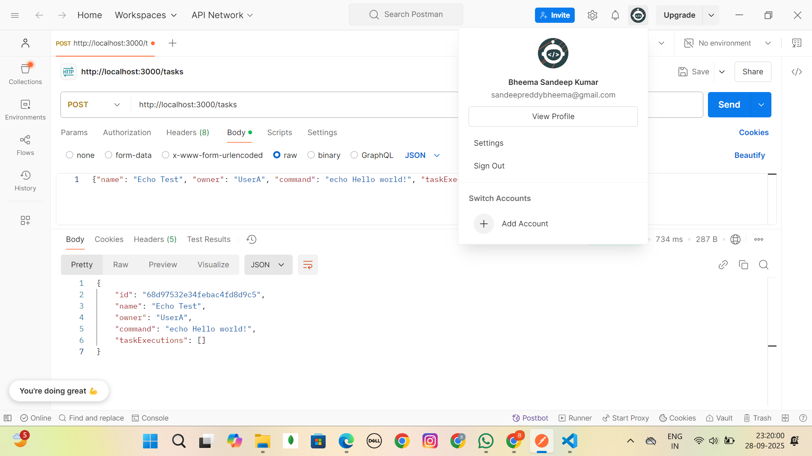
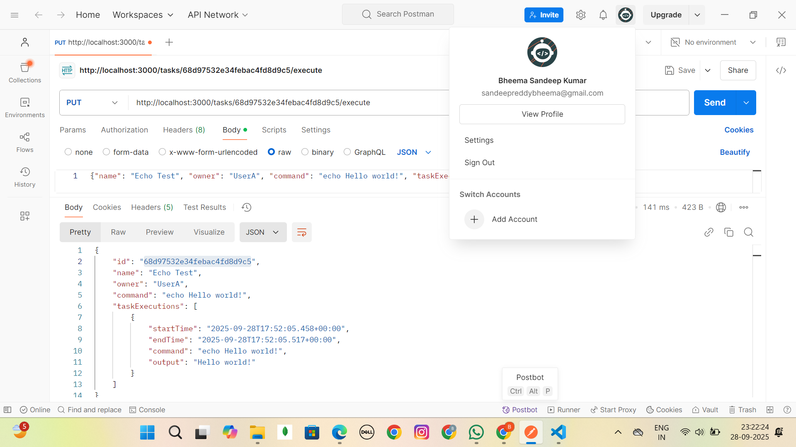
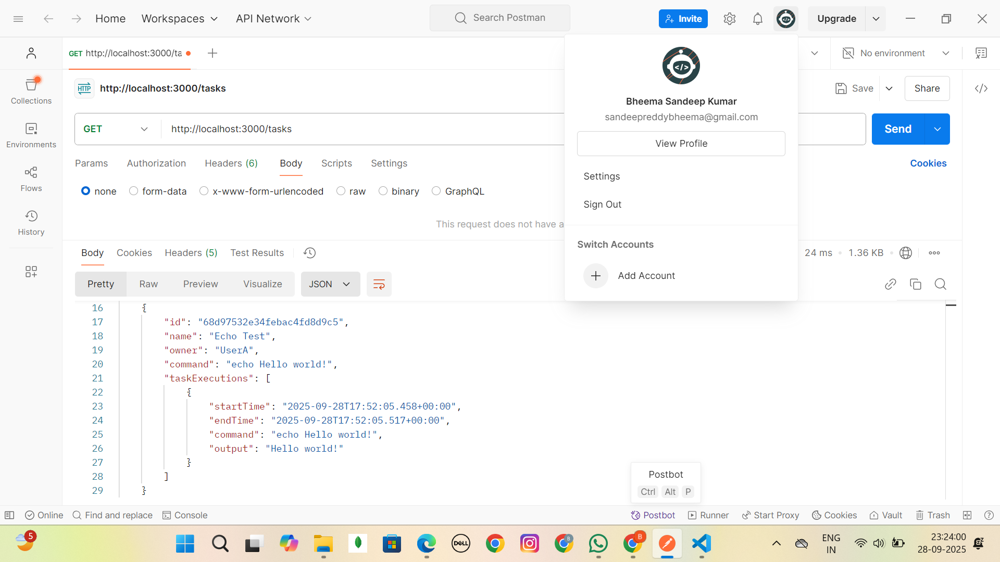
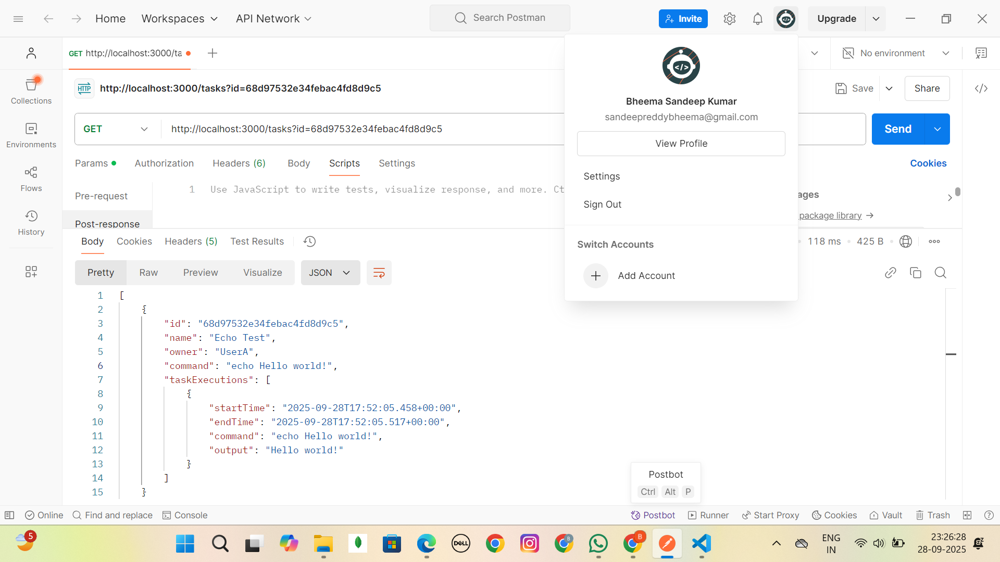
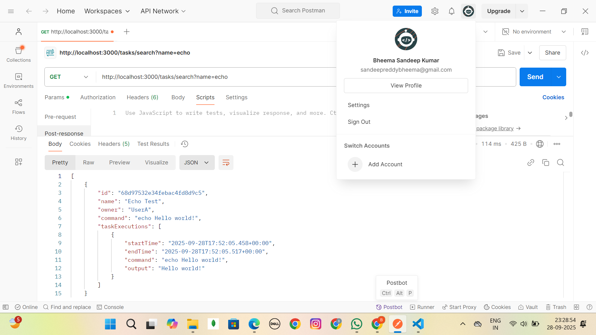
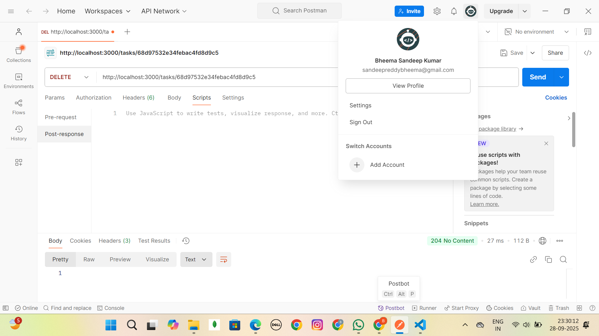

# 🚀 Kaiburr Task 1: Java REST API for Task Management

This repository contains the solution for **Task 1**, a RESTful API built with **Java** and **Spring Boot** to manage and execute shell command tasks persisted in **MongoDB**.

---

## 🌟 Features

* **CRUD Operations**: Create, Read, and Delete `Task` objects.
* **Database Integration**: Uses **Spring Data MongoDB** to persist task data.
* **Shell Command Execution**: Executes the task’s command and stores the `TaskExecution` log (start time, end time, output).
* **Custom Search**: Find tasks by name (case-insensitive search).
* **Secure Validation**: Prevents execution of unsafe/malicious commands (e.g., `rm`, `sudo`).

---

## 🏛️ Architecture Overview

The project follows a standard three-tier architecture:

* **Java Spring Boot (Application Layer)**: Handles HTTP routing, business logic, and command execution.
* **MongoDB (Data Layer)**: Stores `Task` and `TaskExecution` objects.

> ⚠️ The application expects a **local MongoDB server** running on **port 27017**.

---

## 🛠️ Prerequisites

Ensure the following are installed on your machine:

* Java **JDK 17+**
* **Apache Maven 3.9+**
* A running **Local MongoDB Server** (default port: `27017`)
* **VS Code** with:

  * Spring Boot Extension Pack
  * REST Client extension (for easy testing)

---

## 🚀 How to Run the Application

1. **Start MongoDB** locally (ensure it listens on port `27017`).

2. **Run the Spring Boot app using Maven** (inside the project root where `pom.xml` is located):

   ```bash
   mvn spring-boot:run
   ```

   Alternatively, run the `Task1Application.java` file directly from VS Code.

3. The application starts at:

   ```
   http://localhost:3000
   ```

   (Check console logs if a different port is used.)

---

## ⚙️ API Endpoints

Base URL: **`http://localhost:3000/tasks`**

| Method     | Endpoint                    | Description                                           |
| ---------- | --------------------------- | ----------------------------------------------------- |
| **PUT**    | `/tasks`                    | **Create** a new task (JSON body required).           |
| **GET**    | `/tasks`                    | Retrieve **all tasks**.                               |
| **GET**    | `/tasks?id={taskId}`        | Retrieve a single task by ID.                         |
| **GET**    | `/tasks/search?name={name}` | Search tasks by **name** (case-insensitive).          |
| **PUT**    | `/tasks/{taskId}/execute`   | **Execute** the shell command for the specified task. |
| **DELETE** | `/tasks/{taskId}`           | **Delete** the task with the specified ID.            |

Perfect 👍 — instead of listing the **test cases in a table**, we’ll give each case its own short description + a placeholder for its screenshot.

This style is super clean for GitHub because you can drop in your screenshots later (just replace the image links).

Here’s the revised section of your `README.md`:

---

## ✅ API Testing Screenshots

Below are the screenshots for each API test case.
Each screenshot demonstrates the **request** and the **response** from Postman/REST Client.

> 📸 **Tip:** Replace the `` placeholders with the actual paths to your screenshots (store them in a `screenshots/` folder in your repo).

---

### Create Task

Creates a new task with `name`, `owner`, and `command`.



---

### Execute Task (Success)

Executes the shell command for the created task successfully.



---

### Get All Tasks

Retrieves a list of all tasks.



---

### Get Task by ID

Retrieves a single task using its ID.



---

### Search by Name

Searches tasks by a substring of the name (case-insensitive).



---

### Delete Task (Success)

Deletes an existing task.


